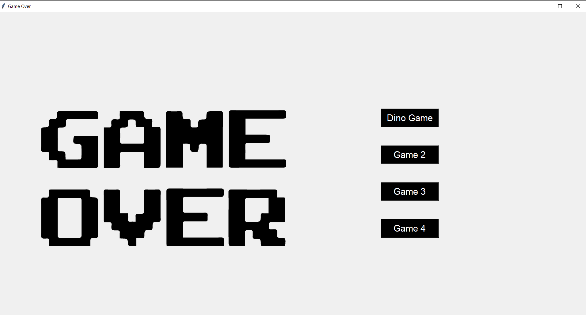
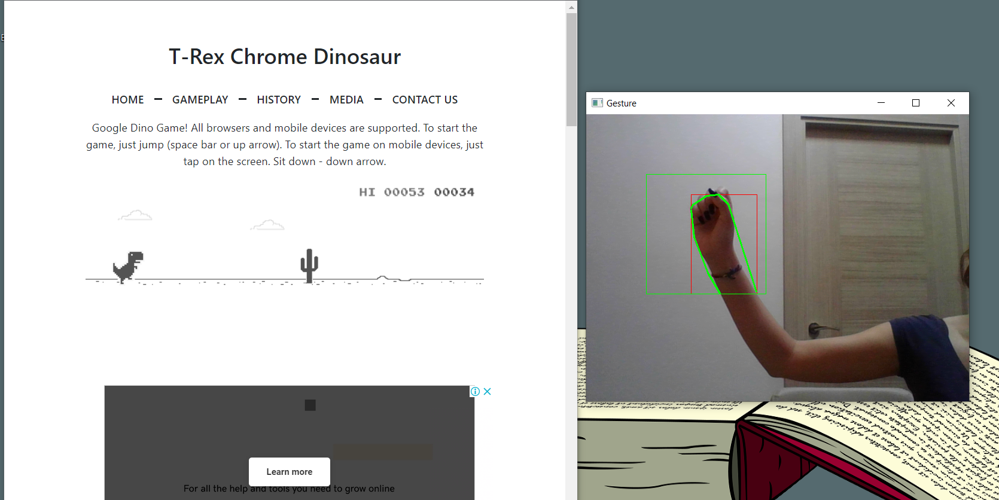
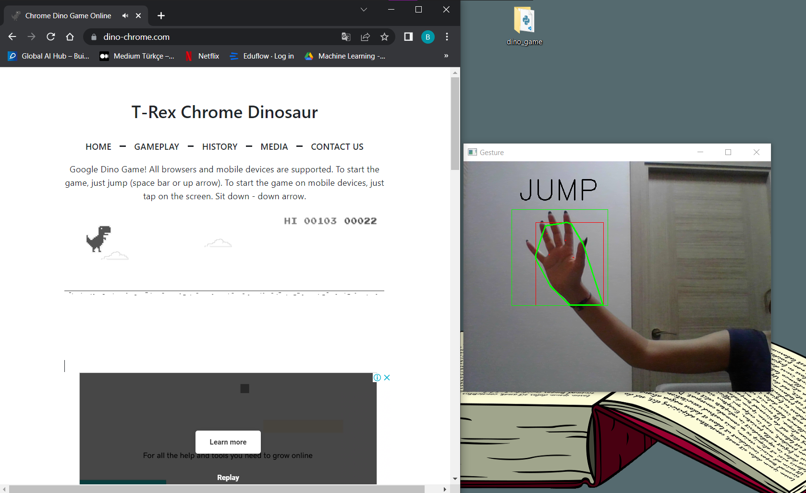

# Play Dinı Game With Hand




     


This interface is built using the Tkinter library. The aim is to play the dinosaur game with hand gestures without using a keyboard, using OpenCV, an image processing library.

# USAGE

```bash
# Activate env
$ env\Scripts\activate

# Install libraries
$ pip install -r requirements.txt

# Run it
$ python dino_game.py
```
# IMPORTANT NOTES

! Make sure you grant usage permission for the camera.
! The background should be white and there should be no objects.
! Find an online dino game beforehand and start the project while the game is open.
! After starting the project, you should left-click on the game tab so that the space key can be used.
! Press 0 to close the camera window.
